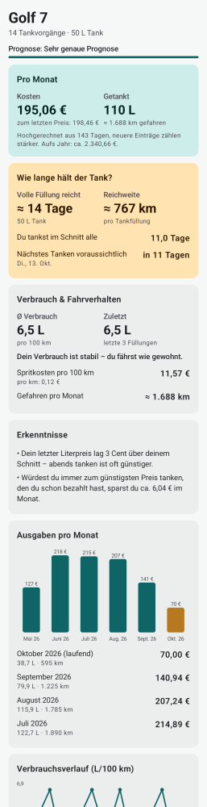
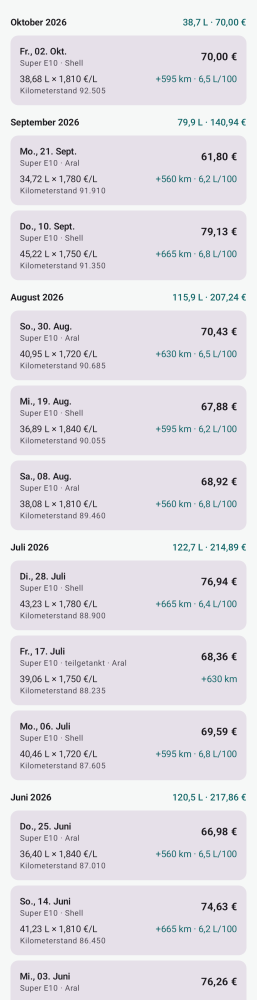

# Tank-Tagebuch (Android-App)

Eigenständige Android-App, die nur das Tank-Tagebuch aus TankRadar enthält –
offline, ohne Konto, alle Daten bleiben auf dem Handy.

**Download:** [`downloads/TankTagebuch.apk`](../downloads/TankTagebuch.apk)
(Android 8.0 oder neuer). Beim ersten Installieren muss „Installation aus
unbekannten Quellen“ für den Browser bzw. Dateimanager erlaubt werden.

| Übersicht | Tagebuch |
|---|---|
|  |  |

## Was die App kann

- Tankvorgang eintragen: Datum, Kraftstoff, Liter, Preis/L, Gesamtbetrag
  (das dritte Feld wird automatisch aus den anderen beiden berechnet),
  Vollgetankt ja/nein, Tankstelle, Notiz.
- Kilometer optional – entweder als **Kilometerstand** oder als **gefahrene km**
  seit dem letzten Tanken.
- Auswertung, die mit jedem Eintrag genauer wird:
  - Kosten, Liter und Kilometer **pro Monat** (plus Hochrechnung aufs Jahr)
  - **Wie lange eine Tankfüllung hält** (Tage) und Reichweite (km)
  - Voraussichtliches **nächstes Tanken**
  - **Verbrauch** in L/100 km (Volltank-Methode) und **Fahrverhalten-Trend**
    (sparsamer / wie gewohnt / mehr als sonst)
  - Spritkosten pro 100 km, Monatsdiagramm, Verbrauchsverlauf, Preisstatistik
  - Anzeige der Prognosequalität und wie viele Einträge bis zur nächsten Stufe fehlen
- CSV-Export/-Import zur Datensicherung.

## Wie gerechnet wird

Siehe `app/src/main/java/de/tankradar/tagebuch/logic/Analyzer.kt`:

- Raten pro Tag werden aus den Abständen zwischen den Tankvorgängen berechnet;
  jüngere Abstände zählen stärker (Halbwertszeit 120 Tage). Lange Lücken im
  Tagebuch (≥ 60 Tage bzw. 4× der typische Abstand) werden ignoriert.
- Verbrauch: Liter zwischen zwei Volltankungen (inkl. Teilbetankungen) geteilt
  durch die gefahrene Strecke; unplausible Werte werden verworfen.

## Bauen

```bash
cd android
./gradlew testReleaseUnitTest assembleRelease
# -> app/build/outputs/apk/release/app-release.apk
```

Benötigt JDK 17+ und das Android SDK (Platform 35). Der GitHub-Workflow
`.github/workflows/android-apk.yml` baut die APK bei jeder Änderung unter
`android/` und stellt sie als Artefakt bereit.

Die APK ist mit dem Schlüssel `app/tanktagebuch.keystore` signiert. Er liegt
bewusst im Repo, damit jede neue Version über die alte installiert werden kann,
ohne dass die eingetragenen Daten verloren gehen. Für eine Veröffentlichung im
Play Store sollte ein eigener, geheimer Schlüssel verwendet werden.
